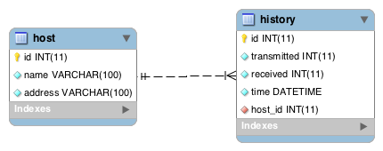

# SQL

## Referências
---
- [MySQL - SQL Statement Syntax](https://dev.mysql.com/doc/refman/5.7/en/sql-syntax.html)
- Mysql: [Tipos](https://www.tutorialspoint.com/mysql/mysql-data-types.htm), [Funções](https://www.w3schools.com/sql/sql_ref_mysql.asp), [Operadores](https://www.w3schools.com/sql/sql_operators.asp)
- [Oracle - Database SQL Language Reference](https://docs.oracle.com/database/121/SQLRF/toc.htm)
- SQL Tutorial: [W3Schools](https://www.w3schools.com/sql/default.asp) e [TutorialsPoint](https://www.tutorialspoint.com/sql/index.htm)
- SQL cheat sheet: [ZeroTurnaround](https://zeroturnaround.com/rebellabs/sql-cheat-sheet/), [cse.unl.edu](http://cse.unl.edu/~sscott/ShowFiles/SQL/CheatSheet/SQLCheatSheet.html), [hofmannsven](https://gist.github.com/hofmannsven/9164408), [sqltutorial](http://www.sqltutorial.org/sql-cheat-sheet/)

## Dados
---

| name               | address      | transmitted | received | time                |
|--------------------|--------------|-------------|----------|---------------------|
| portal.ifrn.edu.br | 10.0.0.100   |           4 |        4 | 2018-02-16 13:41:49 |
| portal.ifrn.edu.br | 10.0.0.100   |           8 |        4 | 2018-02-16 13:41:49 |
| portal.ifrn.edu.br | 10.0.0.100   |           4 |        3 | 2018-02-16 13:41:49 |
| ...                | ...          |         ... |      ... | ...                 |
| www.ifpb.edu.br    | 200.10.10.12 |           5 |        5 | 2018-02-18 13:41:49 |

### Questões

1. Quantos pacotes foram recebidos?
2. Qual é a média de pacotes perdidos?
3. Qual é a porcentagem de pacotes recebidos do IFPB?
4. Qual é a porcentagem de pacotes perditos do IFPB no dia 16/02/2018 entre 09:00 até 18:00?

## Comandos
---

```
$ mysql_secure_installation
```

```
$ mysql -u [username] -p
$ mysql -u root -p
Enter password: 
Welcome to the MySQL monitor.  Commands end with ; or \g.
Your MySQL connection id is 56
Server version: 5.5.59-0ubuntu0.14.04.1 (Ubuntu)

Copyright (c) 2000, 2016, Oracle and/or its affiliates. All rights reserved.

Oracle is a registered trademark of Oracle Corporation and/or its
affiliates. Other names may be trademarks of their respective
owners.

Type 'help;' or '\h' for help. Type '\c' to clear the current input statement.

mysql>
```

```
$ mysql -h[host] -P[post] -u[username] -p[password]
$ mysql -h127.0.0.1 -P3306 -uroot -pabc123
mysql: [Warning] Using a password on the command line interface can be insecure.
Welcome to the MySQL monitor.  Commands end with ; or \g.
Your MySQL connection id is 57
Server version: 5.5.59-0ubuntu0.14.04.1 (Ubuntu)

Copyright (c) 2000, 2016, Oracle and/or its affiliates. All rights reserved.

Oracle is a registered trademark of Oracle Corporation and/or its
affiliates. Other names may be trademarks of their respective
owners.

Type 'help;' or '\h' for help. Type '\c' to clear the current input statement.

mysql>
```

```
$ mysqldump -u [username] -p [database] > [database]_backup.sql
$ mysqldump -u root -p monitor_db > monitor_db_backup.sql
```

```
$ mysqldump -u root -p --no-create-info monitor_db > monitor_db_backup.sql # data only
$ mysqldump -u root -p --no-data monitor_db > monitor_db_backup.sql # structure only
$ mysqldump -u root -p --all-databases > database_backup.sql # database
```

```
$ mysql -u [username] -p [database] < database_backup_backup.sql
```

## SQL
---

> **DICAS:**
> - Os comandos não são *case sensitive*
> - Os nomes são *case sensitive*
> - Não esqueça do `;` nos comandos
> - Em caso de erro tente interpretar a mensagem de erro

```sql
> SHOW DATABASES;
+--------------------+
| Database           |
+--------------------+
| information_schema |
| mysql              |
| performance_schema |
+--------------------+
3 rows in set (0.00 sec)

> CREATE DATABASE monitor_db;
Query OK, 1 row affected (0.00 sec)

> SHOW DATABASES;
+--------------------+
| Database           |
+--------------------+
| information_schema |
| monitor_db         |
| mysql              |
| performance_schema |
+--------------------+
4 rows in set (0.00 sec)

> DROP DATABASE monitor_db;
Query OK, 0 rows affected (0.00 sec)

> SHOW DATABASES;
+--------------------+
| Database           |
+--------------------+
| information_schema |
| mysql              |
| performance_schema |
+--------------------+
3 rows in set (0.00 sec)
```

```sql
> USE monitor_db;
Database changed

> SELECT DATABASE();
+------------+
| DATABASE() |
+------------+
| monitor_db |
+------------+
1 row in set (0.00 sec)
```

```sql
> SHOW TABLES;
Empty set (0.00 sec)

> CREATE TABLE host (
  id int NOT NULL AUTO_INCREMENT,
  name varchar(100) NOT NULL,
  address varchar(100) NOT NULL,
  PRIMARY KEY (id)
);
Query OK, 0 rows affected (0.00 sec)

> SHOW TABLES;
+----------------------+
| Tables_in_monitor_db |
+----------------------+
| host                 |
+----------------------+
1 row in set (0.00 sec)

> DESCRIBE host;
+---------+--------------+------+-----+---------+----------------+
| Field   | Type         | Null | Key | Default | Extra          |
+---------+--------------+------+-----+---------+----------------+
| id      | int(11)      | NO   | PRI | NULL    | auto_increment |
| name    | varchar(100) | NO   |     | NULL    |                |
| address | varchar(100) | NO   |     | NULL    |                |
+---------+--------------+------+-----+---------+----------------+
3 rows in set (0.00 sec)

> DROP TABLE host;
Query OK, 0 rows affected (0.00 sec)
```

```sql
> SHOW TABLES;
+----------------------+
| Tables_in_monitor_db |
+----------------------+
| host                 |
+----------------------+
1 row in set (0.01 sec)

> RENAME TABLE host TO hosts;
Query OK, 0 rows affected (0.00 sec)

> SHOW TABLES;
+----------------------+
| Tables_in_monitor_db |
+----------------------+
| hosts                |
+----------------------+
1 row in set (0.01 sec)
```

```sql
> DESCRIBE host;
+---------+--------------+------+-----+---------+----------------+
| Field   | Type         | Null | Key | Default | Extra          |
+---------+--------------+------+-----+---------+----------------+
| id      | int(11)      | NO   | PRI | NULL    | auto_increment |
| name    | varchar(100) | NO   |     | NULL    |                |
| address | varchar(100) | NO   |     | NULL    |                |
+---------+--------------+------+-----+---------+----------------+

> ALTER TABLE host ADD COLUMN mask varchar(100);
Query OK, 0 rows affected (0.01 sec)
Records: 0  Duplicates: 0  Warnings: 0

> DESCRIBE host;
+---------+--------------+------+-----+---------+----------------+
| Field   | Type         | Null | Key | Default | Extra          |
+---------+--------------+------+-----+---------+----------------+
| id      | int(11)      | NO   | PRI | NULL    | auto_increment |
| name    | varchar(100) | NO   |     | NULL    |                |
| address | varchar(100) | NO   |     | NULL    |                |
| mask    | varchar(100) | YES  |     | NULL    |                |
+---------+--------------+------+-----+---------+----------------+
4 rows in set (0.00 sec)

> ALTER TABLE host DROP COLUMN mask;
Query OK, 0 rows affected (0.01 sec)
Records: 0  Duplicates: 0  Warnings: 0

> DESCRIBE host;
+---------+--------------+------+-----+---------+----------------+
| Field   | Type         | Null | Key | Default | Extra          |
+---------+--------------+------+-----+---------+----------------+
| id      | int(11)      | NO   | PRI | NULL    | auto_increment |
| name    | varchar(100) | NO   |     | NULL    |                |
| address | varchar(100) | NO   |     | NULL    |                |
+---------+--------------+------+-----+---------+----------------+
3 rows in set (0.00 sec)
```

```sql
> INSERT INTO host
    VALUES (1, 'www.ifpb.edu.br', '200.10.10.10');
Query OK, 1 row affected (0.01 sec)
```

```sql
> INSERT INTO host
      (name, address)
    VALUES
      ('www.ifrn.edu.br', '200.10.10.11'),
      ('www.ifpb.edu.br', '200.10.10.12');
Query OK, 2 rows affected (0.01 sec)
Records: 2  Duplicates: 0  Warnings: 0
```

```sql
> SELECT * FROM host;
+----+-----------------+--------------+
| id | name            | address      |
+----+-----------------+--------------+
|  1 | www.ifpb.edu.br | 200.10.10.10 |
|  2 | www.ifrn.edu.br | 200.10.10.11 |
|  3 | www.ifpb.edu.br | 200.10.10.12 |
+----+-----------------+--------------+
3 rows in set (0.00 sec)
```

```sql
> SELECT name, address FROM host;
+-----------------+--------------+
| name            | address      |
+-----------------+--------------+
| www.ifpb.edu.br | 200.10.10.10 |
| www.ifrn.edu.br | 200.10.10.11 |
| www.ifpb.edu.br | 200.10.10.12 |
+-----------------+--------------+
3 rows in set (0.00 sec)
```

```sql
> SELECT name, address FROM host 
    ORDER BY name;
+-----------------+--------------+
| name            | address      |
+-----------------+--------------+
| www.ifpb.edu.br | 200.10.10.10 |
| www.ifpb.edu.br | 200.10.10.12 |
| www.ifrn.edu.br | 200.10.10.11 |
+-----------------+--------------+
3 rows in set (0.01 sec)
```

```sql
> SELECT name, address FROM host 
    WHERE id = 1;
+-----------------+--------------+
| name            | address      |
+-----------------+--------------+
| www.ifpb.edu.br | 200.10.10.10 |
+-----------------+--------------+
1 row in set (0.00 sec)
```

```sql
> SELECT name, address FROM host 
    WHERE name LIKE '%ifpb%' AND address LIKE '200.%.%.%';
+-----------------+--------------+
| name            | address      |
+-----------------+--------------+
| www.ifpb.edu.br | 200.10.10.10 |
| www.ifpb.edu.br | 200.10.10.12 |
+-----------------+--------------+
2 rows in set (0.00 sec)
```

```sql
> SELECT * FROM host 
    LIMIT 2;
+----+-----------------+--------------+
| id | name            | address      |
+----+-----------------+--------------+
|  1 | www.ifpb.edu.br | 200.10.10.10 |
|  2 | www.ifrn.edu.br | 200.10.10.11 |
+----+-----------------+--------------+
2 rows in set (0.00 sec)
```

```sql
> SELECT * FROM host 
    LIMIT 2 
    OFFSET 1;
+----+-----------------+--------------+
| id | name            | address      |
+----+-----------------+--------------+
|  2 | www.ifrn.edu.br | 200.10.10.11 |
|  3 | www.ifpb.edu.br | 200.10.10.12 |
+----+-----------------+--------------+
2 rows in set (0.00 sec)
```

```sql
> SELECT COUNT(*) AS total FROM host;
+-------+
| total |
+-------+
|     3 |
+-------+
1 row in set (0.00 sec)
```

```sql
> SELECT * FROM host 
    WHERE id = 2;
+----+-----------------+--------------+
| id | name            | address      |
+----+-----------------+--------------+
|  2 | www.ifrn.edu.br | 200.10.10.11 |
+----+-----------------+--------------+

> UPDATE host
    SET address = '10.0.0.10'
    WHERE id = 2;
Query OK, 1 row affected (0.01 sec)
Rows matched: 1  Changed: 1  Warnings: 0

> SELECT * FROM host 
    WHERE id = 2;
+----+-----------------+-----------+
| id | name            | address   |
+----+-----------------+-----------+
|  2 | www.ifrn.edu.br | 10.0.0.10 |
+----+-----------------+-----------+
1 row in set (0.00 sec)

> UPDATE host
    SET name = 'portal.ifrn.edu.br', address = '10.0.0.100' 
    WHERE id = 2;
Query OK, 1 row affected (0.01 sec)
Rows matched: 1  Changed: 1  Warnings: 0

> SELECT * FROM host 
    WHERE id = 2;
+----+--------------------+------------+
| id | name               | address    |
+----+--------------------+------------+
|  2 | portal.ifrn.edu.br | 10.0.0.100 |
+----+--------------------+------------+
```

```sql
> SELECT * FROM host;
+----+-----------------+--------------+
| id | name            | address      |
+----+-----------------+--------------+
|  1 | www.ifpb.edu.br | 200.10.10.10 |
+----+-----------------+--------------+

> DELETE FROM host
    WHERE id = 1;
Query OK, 1 row affected (0.01 sec)

> SELECT * FROM host 
    WHERE id = 1;
Empty set (0.00 sec)
```

> **DICA:** Muito cuidado com o `DELETE` e `UPDATE` sem o `WHERE`!

```sql
> CREATE TABLE history (
    id int NOT NULL AUTO_INCREMENT,
    transmitted int NOT NULL,
    received int NOT NULL,
    time datetime NOT NULL,
    host_id int NOT NULL,
    PRIMARY KEY (id),
    KEY host_id (host_id),
    CONSTRAINT fk_host_id FOREIGN KEY (host_id) REFERENCES host (id)
);
Query OK, 0 rows affected (0.02 sec)

> DESCRIBE history;
+-------------+---------+------+-----+---------+----------------+
| Field       | Type    | Null | Key | Default | Extra          |
+-------------+---------+------+-----+---------+----------------+
| id          | int(11) | NO   | PRI | NULL    | auto_increment |
| transmitted | int(11) | YES  |     | NULL    |                |
| received    | int(11) | YES  |     | NULL    |                |
| time        | time    | YES  |     | NULL    |                |
| host_id     | int(11) | YES  | MUL | NULL    |                |
+-------------+---------+------+-----+---------+----------------+
5 rows in set (0.00 sec)
```



```sql
> INSERT INTO history
    (transmitted, received, time, host_id)
  VALUES
    (4, 4, NOW(), 2),
    (8, 4, NOW(), 2),
    (7, 4, NOW(), 3),
    (5, 5, NOW(), 3),
    (4, 3, NOW(), 2);
Query OK, 5 rows affected (0.01 sec)
Records: 5  Duplicates: 0  Warnings: 0

> SELECT * FROM history;
+----+-------------+----------+---------------------+---------+
| id | transmitted | received | time                | host_id |
+----+-------------+----------+---------------------+---------+
|  1 |           4 |        4 | 2018-02-16 13:41:49 |       2 |
|  2 |           8 |        4 | 2018-02-16 13:41:49 |       2 |
|  3 |           7 |        4 | 2018-02-16 13:41:49 |       3 |
|  4 |           5 |        5 | 2018-02-16 13:41:49 |       3 |
|  5 |           4 |        3 | 2018-02-16 13:41:49 |       2 |
+----+-------------+----------+---------------------+---------+
5 rows in set (0.00 sec)

> SELECT 
    * 
  FROM 
    host INNER JOIN history;
+----+--------------------+--------------+----+-------------+----------+---------------------+---------+
| id | name               | address      | id | transmitted | received | time                | host_id |
+----+--------------------+--------------+----+-------------+----------+---------------------+---------+
|  2 | portal.ifrn.edu.br | 10.0.0.100   |  1 |           4 |        4 | 2018-02-16 13:41:49 |       2 |
|  3 | www.ifpb.edu.br    | 200.10.10.12 |  1 |           4 |        4 | 2018-02-16 13:41:49 |       2 |
|  2 | portal.ifrn.edu.br | 10.0.0.100   |  2 |           8 |        4 | 2018-02-16 13:41:49 |       2 |
|  3 | www.ifpb.edu.br    | 200.10.10.12 |  2 |           8 |        4 | 2018-02-16 13:41:49 |       2 |
|  2 | portal.ifrn.edu.br | 10.0.0.100   |  3 |           7 |        4 | 2018-02-16 13:41:49 |       3 |
|  3 | www.ifpb.edu.br    | 200.10.10.12 |  3 |           7 |        4 | 2018-02-16 13:41:49 |       3 |
|  2 | portal.ifrn.edu.br | 10.0.0.100   |  4 |           5 |        5 | 2018-02-16 13:41:49 |       3 |
|  3 | www.ifpb.edu.br    | 200.10.10.12 |  4 |           5 |        5 | 2018-02-16 13:41:49 |       3 |
|  2 | portal.ifrn.edu.br | 10.0.0.100   |  5 |           4 |        3 | 2018-02-16 13:41:49 |       2 |
|  3 | www.ifpb.edu.br    | 200.10.10.12 |  5 |           4 |        3 | 2018-02-16 13:41:49 |       2 |
+----+--------------------+--------------+----+-------------+----------+---------------------+---------+
10 rows in set (0.00 sec)

> SELECT 
    * 
  FROM 
    host INNER JOIN history
  WHERE 
    host.id = history.host_id;
+----+--------------------+--------------+----+-------------+----------+---------------------+---------+
| id | name               | address      | id | transmitted | received | time                | host_id |
+----+--------------------+--------------+----+-------------+----------+---------------------+---------+
|  2 | portal.ifrn.edu.br | 10.0.0.100   |  1 |           4 |        4 | 2018-02-16 13:41:49 |       2 |
|  2 | portal.ifrn.edu.br | 10.0.0.100   |  2 |           8 |        4 | 2018-02-16 13:41:49 |       2 |
|  2 | portal.ifrn.edu.br | 10.0.0.100   |  5 |           4 |        3 | 2018-02-16 13:41:49 |       2 |
|  3 | www.ifpb.edu.br    | 200.10.10.12 |  3 |           7 |        4 | 2018-02-16 13:41:49 |       3 |
|  3 | www.ifpb.edu.br    | 200.10.10.12 |  4 |           5 |        5 | 2018-02-16 13:41:49 |       3 |
+----+--------------------+--------------+----+-------------+----------+---------------------+---------+
5 rows in set (0.00 sec)

> SELECT 
    sum(history.transmitted) AS transmitted, 
    sum(history.received) AS received, 
    round(received/transmitted, 2) AS percent 
  FROM 
    host INNER JOIN history
  WHERE 
    host.id = history.host_id AND 
    host.name LIKE '%ifpb%';
+-------------+----------+---------+
| transmitted | received | percent |
+-------------+----------+---------+
|          12 |        9 |    0.57 |
+-------------+----------+---------+
1 row in set (0.00 sec)
```

```sql
> exit
Bye
```

<!-- 
TODO
- diagram txt, png
  - https://github.com/BurntSushi/erd
  - https://erdplus.com/#/
  - https://www.guitex.org/home/images/ArsTeXnica/AT015/drawing-ER-diagrams-with-TikZ.pdf
  - mysql workbench
- ALTER TABLE tablename AUTO_INCREMENT = 1
- explorar mensagem de error
- pacotes do ifpb perdidos de 09:00 18:00 do dia X
- select * from history where id = (select id from history order by id desc limit 1);
-->