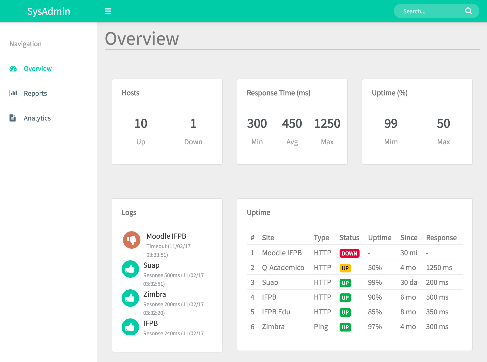
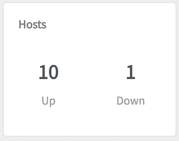
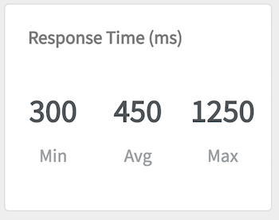
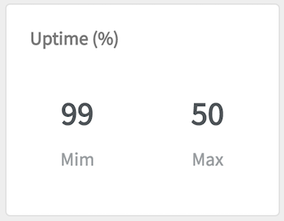
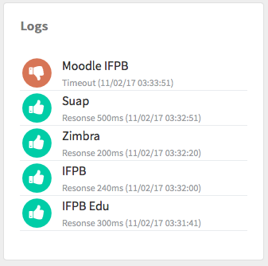
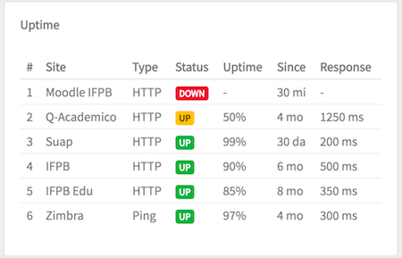

# Prova DW - HTML & CSS

### OBSERVAÇÕES

Leia as observações a seguir:

* A avaliação será realizada no computador, porém individualmente e em silêncio. Não deve haver nenhum tipo de comunicação entre os alunos;
* Cada COMPONENTE é expressa através dessa indicação **(DD%)** que significa o critério de pontuação, contudo, a desorganização pode penalizar a pontuação final;
* No arquivo de resposta inclua um bloco de comentário no início de seu conteúdo com o nome e a matrícula do aluno;
* Ao concluir as questões chame o professor para avaliar a sua prova;
* Depois da avaliação envie os arquivos num diretório compactado, seguindo o formato de nome **ALUNO-MATRICULA** para o email **luiz.chaves.ifpb+avaliacoesdw20172@gmail.com** com:

> **Assunto:** [IFPB] Prova I DW
>
> **Conteúdo:** Os arquivos da prova do aluno < nome do aluno > (< matrícula >) estão em anexo.

### DESCRIÇÃO DA PROVA

Considere que o IFPB está com uma demanda técnica relacionado ao suporte de seus serviços na Internet, no qual foi exigido realizar uma análise e acompanhamento dos serviços mantidos pela instituição, como o Q-Acadêmico, SUAP, Portal do IFPB, etc. Ao analisar o mercado foi possível encotrar muitos ferramentas que atendiam essa demanda. 

Uma opção considerada interessante foi o [Pingdom](https://www.pingdom.com), que é uma ferramenta de monitoramento de desempenho de Websites, com suporte a geração de métricas e relatórios sofisticados. Contudo, o preço de sua licença não está previsto no orçamento da instituição, além disso, de todos o recursos oferecidos, a funcilinalidades mais essencial no momento seria a de visualização de algumas métricas de disponibilidade.

Então, diante dessa problemática, a DTI abriu um processo de seleção com os alunos do IFPB para recrutar alguém com domínio no tema, e que pudesse criar um pequeno sistema de monitoramento Web.

A princípio foi disponibilizado um layout de como seria o sistema neste [arquivo](code.zip), em uma versão bem inicial já inicializada por um funcionário do setor, mas, a ideia é que no final a página fique semelhante ao da *Figura 1*. Portanto, cabe a você candidato continuar o desenvolvimento através das questões que serão levantadas a seguir.

*Figura 1 - Layout da página*



Para facilitar esse processo, o desenvolvimento será distribuido em **componentes** e alguns conteúdos serão previamente disponibilizados por meio do arquivo obtido, por exemplo, um dos componentes será o painel de registros de monitoramento (Logs), e como ponto de partida, os arquivos disponibilizados já oferecem algum conteúdo para a criação de estruturas e estilização do painel, respectivamente em [`code/index.html`](code/index.html) e [`code/css/custom.css`](code/css/custom.css).

> **Observação:** A princípio deve ser entregue ao menos o Componente 4 ou 5.

### COMPONENTES

**COMPONENTE 1 - (50%)** Crie o conteúdo do Painel de Hosts no arquivo [`code/index.html`](code/index.html), especificamente em `TODO Hosts`:

```html
<!-- 
TODO Hosts 
10 Up 
1 Down
--> 
```

mas considerando que:

* O painel será construíndo usando um `card` do [Bootstrap](http://getbootstrap.com) que ocupará 1/3 do `main`.
* O título do painel deve ser feito com um `h4.card-title` de tamanho `16px`, negrito de `600`, altura de linha de `16px` e margem inferior de `30px`;
* A classe `counter` deve possuir a cor `#505458`;
* O conteúdo do painel `10 Up` deve seguir a estrutura:

```
<div>
  <h3 class="counter">10</h3>
  <p class="text-muted">Up</p>
</div>
``` 

* O painel deve apresentar a disponsição conforme a *Figura 2*.

*Figura 2 - Painel de Hosts*<br>



**COMPONENTE 2 - (50%)** Crie o conteúdo do Painel de tempo de resposta no arquivo [`code/index.html`](code/index.html), especificamente em `TODO Response Time (ms)`, mas considerando os estilos do Componente 1 e a aparência da *Figura 3*:

*Figura 3 - Painel do tempo de reposta*<br>




**COMPONENTE 3 - (50%)** Crie o conteúdo do Painel de tempo de disponibilidade no arquivo [`code/index.html`](code/index.html), especificamente em `TODO Uptime (%)`, mas considerando os estilos do Componente 1 e a aparência da *Figura 4*:

*Figura 4 - Painel do tempo de disponibilidade*<br>




**COMPONENTE 4 - (50%)** Crie o conteúdo do Painel de registros de monitoramento (Logs) no arquivo [`code/index.html`](code/index.html), especificamente em `TODO Logs`, mas considerando a aparência da *Figura 5*:

*Figura 5 - Painel de Hosts*<br>



e as seguintes observações:

* O log que estiver com falha de exibir o ícone do font-awesome `fa-thumbs-down` com cor `#cc7c5d`, já o de sucesso deve usar o ícone `fa-thumbs-up` e cor `#57c5a5`. **Obs:** para deixar o ícone arredondado veja esse [exemplo](http://fontawesome.io/examples/#stacked).
* Adicione um distânciamento entre os ícones e a descrição à direita.
* Crie a seguinte estrutura para descrção do log:

```
<div>
  <p class="name">Moodle IFPB</p>
  <p class="response">Timeout (11/02/17 03:33:51)</p>
</div>
```

* Em nome `.name` deve-se configurar a cor `#333333`, a altura de linha de `1.6` e zerar as margens.
* Na resposta `.response` deve-se configurar a cor `#9a9da0`, o tamanho de fonte de `12px` e zerar as margens.
* Em cada log deve haver uma borda inferior de `1px solid #e9ecef`, com exceção do último log.

**COMPONENTE 5 - (50%)** Crie o conteúdo do Painel da tabela dos registros de disponibilidade no arquivo [`code/index.html`](code/index.html), especificamente em `TODO Uptime`, mas considerando a aparência da *Figura 6*:

*Figura 6 - Painel da tabela dos registros de disponibilidade*<br>



e as seguintes observações:

* Crie um tabela conforme o estilo do [Bootstrap](http://getbootstrap.com).
* Na coluna status, os dados devem ser estruturados com `badge` do [Bootstrap](http://getbootstrap.com).
* As bordas devem ser preservadas conforme a *Figura 6*.
* Aplique o recúo interno de `.2rem .5rem` nas células da tabela

> [Alternativa de resposta](code-response/)