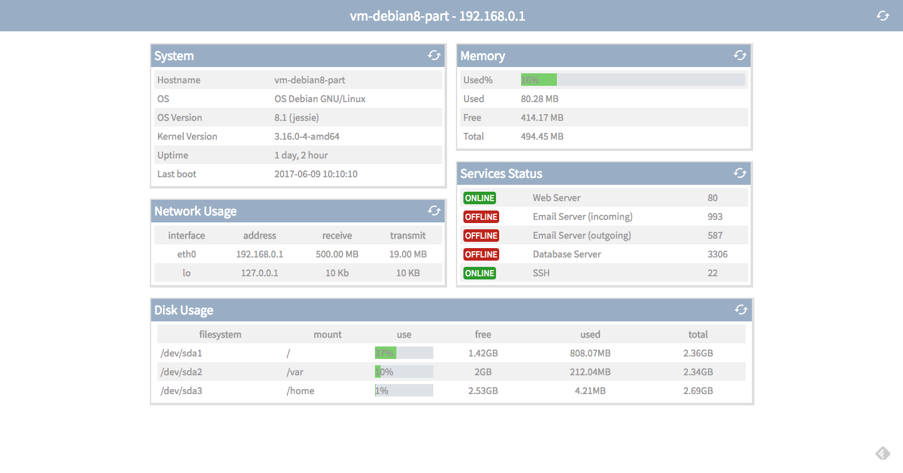

# Prova DW - JS

### OBSERVAÇÕES

Leia as observações a seguir:

* A avaliação será realizada no computador, porém individualmente e em silêncio. Não deve haver nenhum tipo de comunicação entre os alunos;
* Cada questão é expressa através dessa indicação **(DD%)** que significa o critério de pontuação, contudo, a desorganização pode penalizar a pontuação final;
* No arquivo de resposta inclua um bloco de comentário no início de seu conteúdo com o nome e a matrícula do aluno;
* Ao concluir as questões chame o professor para avaliar a sua prova;
* Depois da avaliação envie os arquivos num diretório compactado, seguindo o formato de nome **ALUNO-MATRICULA** para o email **luiz.chaves.ifpb+avaliacoesdw20171@gmail.com** com:

> **Assunto:** [IFPB] Prova II DW
>
> **Conteúdo:** Os arquivos da prova do aluno < nome do aluno > (< matrícula >) estão em anexo.

### DESCRIÇÃO DA PROVA

Considere que a empresa eZ Server Monitor, graças ao sucesso dos profissional no IFPB para gerar o Front-End, veio em busca de um profissional com domínio nos conceitos de adminstração de sistemas, que pudesse continuar a criação da página Web de seu sistema [eSM Web](http://ezservermonitor.com/esm-web/features), corrompido devido a problemas de backup.

A princípio foi disponibilizado o projeto HTML e CSS neste [link](code.zip), contudo, o sistema deve gerar a interface semelhante ao da *Figura 1* usando dados JSON na pasta `data/` por meio da linguagem Javascript.

*Figura 1 - Layout da página*

Portanto, cabe a você continuar o desenvolvimento através das questões que serão levantadas a seguir, e cada questão tem explicito sua forma de pagamento.

Para facilitar nesse processo, cada questão abordará um item específico, no qual seu conteúdo será previamente disponibilizado por meio dos arquivos do último dev Front-End. Por exemplo, uma das questões solicitará a alimentação de dados do painel de informações do sistema, e como ponto de partida, os arquivos disponibilizados já oferecem algum conteúdo, para que assim seja utilizado por você na criação do painel.

### QUESTÕES

**QUESTÃO 1** - Crie o conteúdo do Painel de Informação sobre:

  **a)(E 33%)-** Os dados do sitema, em HMTL *TODO System Info* utilizando o arquivo `data/system.jsom`.

  **b)(O 33%)-** O uso da rede, em HMTL *TODO Network Info* utilizando o arquivo `data/network.jsom`

  **d)(O 33%)-** O status da memória, em HMTL *TODO Memory Info* utilizando o arquivo `data/memory.jsom`

  **c)(E 33%)-** A disponibilidade dos serviços, em HMTL *TODO Service Info* utilizando o arquivo `data/service.jsom`

  **e)(O,E 33%)-** O uso do disco, em HMTL *TODO System Disk* utilizando o arquivo `data/disk.jsom`

**QUESTÃO 2 - (O,E 33%)** Faça que os ícones de loading nos cabeçalhos de cada painal sejam configurados para atualizar os dados.

> [Alternativa de Resposta](code-response/)
